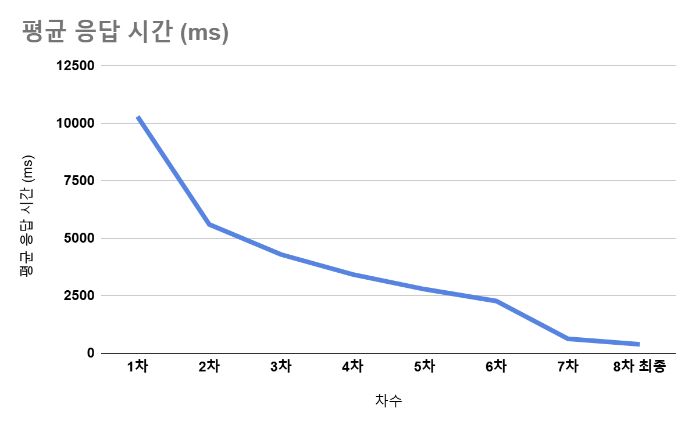

# 🚀 서버 성능 최적화 프로젝트

> Docker 환경(2C2G)에서 10초가 걸리던 API 응답을 300ms까지 개선한 성능 최적화 프로젝트입니다.

## 💭 Background & Motivation

이 프로젝트는 한 가지 의문에서 시작되었습니다:
> "실제 서비스에서는 비용과 자원의 제약이 있는데, 이런 환경에서 어떻게 성능을 최적화할 수 있을까?"

처음에는 단순히 코드 개선만으로 성능을 높일 수 있다고 생각했습니다. 하지만 실제 AWS 환경을 Docker로 구성하여 제한된 자원에서 테스트를 진행하면서, 성능 최적화가 단순한 코드 수정 이상의 것임을 배웠습니다. 특히 한정된 자원 내에서 데이터베이스 처리, 커넥션 관리, 캐싱 전략 등 다양한 요소들을 종합적으로 고려해야 한다는 것을 깨달았습니다.

## 📌 프로젝트 개요

### 🔧 테스트 환경
- **웹 서버**: 2 Core, 2GB RAM
- **MariaDB**: 2 Core, 2GB RAM
- **Redis**: 1 Core, 1GB RAM

### 🎯 성능 개선 목표
- 주요 API 평균 응답시간 300ms 이하 달성
- 대규모 부하 상황(동시 접속자 200명)에서도 안정적인 서비스 응답 유지
- 시스템 자원 사용 효율화

### 📊 테스트 조건
- 200명의 동시 접속자
- 30초의 ramp-up time
- 20회 루프 조건에서 성능 테스트
- 목표 TPS: 25 이상

## 💡 최적화 성과

### API별 성능 개선 결과

| API | 최적화 전 |  | 최적화 후 |  | 개선율 |
|-----|-----------|--|-----------|--|---------|
| | AVG(ms) | TPS | AVG(ms) | TPS | AVG |
| 로그인 | 15,817 | 2.53 | 1,509 | 27.19 | 90.5% |
| 인기 게시글 목록 | 23,691 | 2.53 | 136 | 27.26 | 99.4% |
| 게시글 조회 | 4,582 | 2.54 | 182 | 27.38 | 96.0% |
| 댓글 페이징 조회 | 3,334 | 2.56 | 208 | 27.42 | 93.8% |
| 대댓글 전체 조회 | 3,337 | 0.23 | 334 | 27.44 | 90.0% |
| 포스트 좋아요 | 3,364 | 1.30 | 205 | 13.73 | 93.9% |
| 포스트 좋아요 취소 | 2,653 | 0.65 | 310 | 6.87 | 88.3% |
| 루트 댓글 작성 | 3,241 | 0.39 | 168 | 4.12 | 94.8% |
| 대댓글 작성 | 3,337 | 0.23 | 317 | 2.48 | 90.5% |

## 🛠 레벨별 최적화 전략

### 1. Database Layer

#### Query 최적화
- 실행 계획 분석 및 불필요한 조인/서브쿼리 제거
- 페치 조인 활용으로 N+1 문제 해결
- CTE(Common Table Expression) 도입으로 재귀 쿼리 최적화

#### Redis 캐싱 전략
- 인기 게시글 및 고부하 쿼리 캐싱
- API 응답용과 캐시용 DTO 분리로 효율적인 캐시 운영

#### 인덱스 최적화
- PostLike, Comment 엔티티에 복합 인덱스 추가
- User 엔티티 username 필드 인덱스 추가

#### Batch 처리 최적화
- Hibernate batch_fetch_size 조정 (100 → 1000)
- Projection 적용으로 영속성 컨텍스트 부하 감소

### 2. Infrastructure Layer

#### Connection Pool 최적화
- HikariCP 설정 최적화
  - 최대 풀 사이즈 조정 (150 → 100)
  - 커넥션 타임아웃 설정 최적화
- 로그인 전용 커넥션 풀 분리로 부하 분산

#### Thread Pool 관리
- 로그인 전용 쓰레드 풀 (4 threads) 도입
- 일반 API 쓰레드 풀 (50 threads) 최적화
- 톰캣 쓰레드 수 조정 (200 → 100)

#### 시스템 설정
- 로그 레벨 조정 (DEBUG → INFO)으로 오버헤드 감소
- 프록시 객체 활용으로 불필요한 엔티티 조회 제거

### 3. Application Layer

#### DTO 최적화
- API 응답용과 캐시용 DTO 분리
- Jackson 어노테이션 최적화로 직렬화/역직렬화 성능 개선

#### 인증 로직 개선
- BCrypt 강도 조절 (10 → 8)로 CPU 부하 감소
- JWT 토큰 생성 시 필요 데이터만 전달
- 로그인 전용 DTO 도입으로 불필요한 데이터 로딩 방지

#### JPA 최적화
- N+1 문제 해결을 위한 fetch join 적용
- User-Role 관계 Lazy 로딩 전환
- 엔티티 연관관계 최적화

## 📈 단계별 성능 개선 과정

### 1차 → 2차: Redis 캐싱 도입
- **주요 개선 사항**
  - 인기 게시글 조회 쿼리를 Redis 캐시로 대체
  - DB 부하 완화
- **개선 효과**
  - 로그인 응답시간: 15,817ms → 5,908ms (62.7% 개선)
  - 인기 게시글: 23,691ms → 4,988ms (79% 개선)
  - 에러율: 79% → 0% 안정화
  - DB CPU 사용량: 200% → 90~140% 감소

### 3차: 댓글 로직 최적화
- **주요 개선 사항**
  - fetch join, 배치 사이즈 설정으로 N+1 문제 해결
  - CTE 도입으로 계층 구조 쿼리 최적화
  - 불필요한 컬렉션 로딩 제거
- **개선 효과**
  - 로그인: 5,908ms → 4,161ms (29.6% 개선)
  - 전체 API TPS 42% 상승
  - DB CPU 사용률: 15~25%로 안정화

### 4차: 로그 레벨 및 엔티티 최적화
- **주요 개선 사항**
  - 로그 레벨 DEBUG → INFO 조정
  - BaseEntity에 equals/hashCode 재정의
- **개선 효과**
  - 로그인: 4,161ms → 3,627ms (12.8% 개선)
  - 전체 API 12.8~22.8% 응답시간 개선
  - TPS 12~15로 안정화

### 5차: 커넥션 풀 및 엔티티 관계 최적화
- **주요 개선 사항**
  - HikariCP 커넥션 풀 설정 최적화
  - User-Role Lazy 로딩 전환
  - Projection 적용으로 영속성 컨텍스트 부하 감소
- **교훈**
  - 커넥션 풀 무분별한 확장이 오히려 성능 저하 초래
  - 더 많은 리소스가 항상 더 나은 성능을 의미하지 않음을 확인

### 6차: 시스템 설정 최적화
- **주요 개선 사항**
  - 톰캣 쓰레드 수 조정 (200 → 100)
  - HikariCP 최대 풀 사이즈 조정 (150 → 100)
  - batch_fetch_size 증가 (100 → 1000)
- **개선 효과**
  - 전체 API TPS 70% 이상 증가
  - 시스템 자원 사용 효율화

### 7차: 로그인 아키텍처 개선
- **주요 개선 사항**
  - 로그인 전용 커넥터 및 쓰레드 풀 도입
  - BCrypt 강도 조절 (10 → 8)
  - JWT 토큰 생성 최적화
- **개선 효과**
  - 로그인: 5,565ms → 3,061ms (45% 개선)
  - 로그인 TPS: 14.98 → 28.31 (89% 상승)
  - 주요 API 74~90% 응답시간 개선

### 8차: JSON 처리 및 쓰레드 풀 최적화
- **주요 개선 사항**
  - API 응답용/캐시용 DTO 분리
  - 로그인 전용 쓰레드 풀 (4 threads) 도입
  - 일반 API 쓰레드 풀 (50 threads) 최적화
- **개선 효과**
  - 로그인: 3,061ms → 1,509ms (50.7% 개선)
  - 인기 게시글: 627ms → 182ms (71% 개선)
  - 전체 처리량 27~28 TPS로 안정화

## 🎓 결론 및 배운점

### 1. 성능 최적화는 전체 시스템 관점의 접근이 필요
- 단순 코드 수정을 넘어선 종합적 접근의 중요성
- 각 레이어별 최적화의 상호작용 이해
- DB 쿼리와 인덱스 설계의 중요성

### 2. 리소스 관리는 성능 최적화의 핵심
- 커넥션 풀과 쓰레드 풀의 적절한 설정이 성능에 직접적 영향
- "더 많은 리소스 = 더 좋은 성능"이라는 오해 극복
- 작업 특성에 따른 리소스 분리 관리의 중요성

### 3. 점진적 개선과 측정의 중요성
- 단계별 성능 측정과 개선 효과 분석의 필요성
- 특정 개선이 다른 부분에 미치는 영향 고려
- 데이터 기반의 의사결정 중요성

## 🏗 기술 스택

- **Backend**: Spring Boot, JPA/Hibernate
- **Database**: MariaDB, Redis
- **Infrastructure**: Docker, AWS
- **Tools**: JMeter
- **Language**: Java 17
