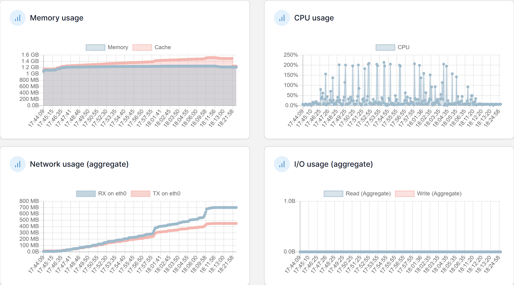
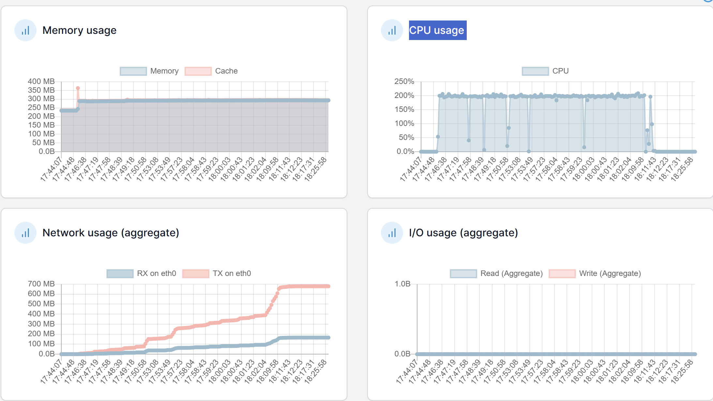

#  1차 테스트 결과

## 📊 시스템 리소스 현황

### Application Server!

| 항목 | 상태 |
|------|------|
| CPU 사용량 | 0~200% 급격한 변동 |
| 메모리 사용량 | 1.2GB로 안정적 유지 |
| 네트워크 사용량 | RX 최대 700MB |

### Database Server

| 항목 | 상태 |
|------|------|
| CPU 사용량 | 200%로 지속적인 포화 상태 |
| 메모리 사용량 | 300MB로 안정적 유지 |
| 네트워크 사용량 | TX 최대 650MB |

## 📈 API 응답 결과

| Label | # Samples | Average | Min | Max | Error % |
|-------|-----------|---------|-----|-----|---------|
| 로그인 | 4000 | 15,817 | 12 | 30,016 | 13.00% |
| 인기 게시글 목록 조회 | 4000 | 23,691 | 2 | 30,024 | 75.98% |
| 인기 게시글 조회 | 4000 | 4,582 | 2 | 30,016 | 78.78% |
| 인기 게시글 댓글 페이징 조회 | 4000 | 3,334 | 2 | 30,017 | 78.30% |
| 포스트 좋아요 | 2000 | 3,364 | 2 | 30,010 | 77.65% |
| 포스트 좋아요 취소 | 1000 | 2,653 | 2 | 30,015 | 79.50% |
| 대댓글 | 360 | 3,337 | 2 | 30,009 | 74.44% |
| 루트 댓글 작성 | 600 | 3,241 | 2 | 30,016 | 78.00% |

## 🚫 문제점 분석

### 주요 에러 패턴 및 원인

| 에러 유형 | 발생 시점 | 원인 |
|-----------|-----------|------|
| SocketTimeoutException | DB 쿼리 실행 중 | - DB 서버 CPU 200% 포화 - 쿼리 처리 지연으로 30초 타임아웃 발생 - 커넥션 장기 점유 |
| CannotCreateTransactionException | 트랜잭션 시작 시점 | - DB 커넥션 풀 고갈 - 커넥션 대기 시간 초과 - 장기 점유된 커넥션 |
| 404 (Not Found) | 요청 라우팅 시점 | - 서버 과부하로 라우팅 실패 - 핸들러 매핑 오류 |
| 405 (Method Not Allowed) | HTTP 메서드 매핑 시점 | - 서버 과부하로 매핑 실패 - 정상 요청이 비정상 처리 |
| 400 (Bad Request) | 요청 처리 시점 | - 파라미터 변환 실패 - 요청 파싱 오류 |

### 🔄 에러 발생 흐름

1. **DB 병목**
    - 동시 요청 증가 → DB CPU 200% → 쿼리 처리 지연

2. **커넥션 고갈**
    - 커넥션 점유 증가 → 풀 고갈 → 트랜잭션 실패

3. **서버 과부하**
    - 쓰레드 대기 증가 → 풀 포화 → 컨텍스트 스위칭 과다

4. **요청 실패**
    - 다양한 에러 발생 → 전체 성능 저하