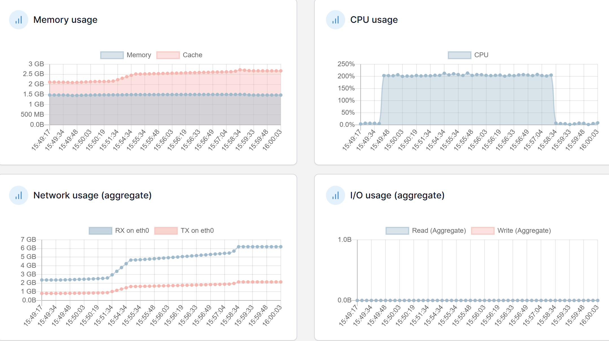
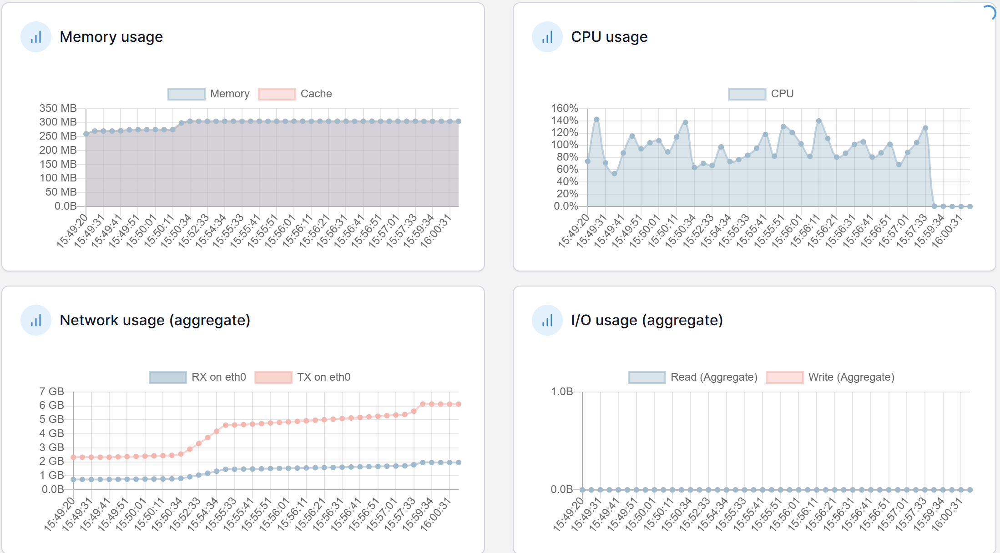

# 2차 성능 테스트 분석 보고서

## 1️⃣ 테스트 개요

### 테스트 환경

- **1차 테스트**: Redis 도입 전 기본 환경
- **2차 테스트**: Redis 캐싱 도입 후 환경
- **테스트 기간**: 2025.01.14
- **테스트 도구**: JMeter

### 주요 개선사항

- 인기글 조회 쿼리 Redis 캐싱 적용

```sql
// 개선 전
@Query("SELECT p FROM Post p " +
       "LEFT JOIN p.likes l " +
       "LEFT JOIN p.comments c " +
       "GROUP BY p.id " +
       "ORDER BY COUNT(DISTINCT l) DESC, COUNT(DISTINCT c) DESC")
Page<Post> findPopularPosts(Pageable pageable);

// 개선 후
Redis 캐시를 통한 인기글 목록 즉시 조회

```

## 📊 API 응답 시간 비교

| API | 1차 테스트 (ms) | 2차 테스트 (ms) | 개선율 |
| --- | --- | --- | --- |
| 로그인 | 15,817 | 5,908 | 62.7% ⬇️ |
| 인기 게시글 목록 조회 | 23,691 | 4,988 | 79.0% ⬇️ |
| 인기 게시글 조회 | 4,582 | 5,691 | -24.2% ⬆️ |
| 인기 게시글 댓글 페이징 조회 | 3,334 | 6,507 | -95.2% ⬆️ |
| 포스트 좋아요 | 3,364 | 4,461 | -32.6% ⬆️ |
| 포스트 좋아요 취소 | 2,653 | 6,895 | -159.9% ⬆️ |
| 루트 댓글 작성 | 3,241 | 3,655 | -12.8% ⬆️ |
| 대댓글 | 3,337 | 7,349 | -120.2% ⬆️ |

## 📈 에러율 비교

| API | 1차 테스트 | 2차 테스트 | 개선율 |
| --- | --- | --- | --- |
| 로그인 | 13.00% | 0.10% | 99.2% ⬇️ |
| 인기 게시글 목록 조회 | 75.98% | 0.10% | 99.9% ⬇️ |
| 인기 게시글 조회 | 78.78% | 0.10% | 99.9% ⬇️ |
| 인기 게시글 댓글 페이징 조회 | 78.30% | 0.10% | 99.9% ⬇️ |
| 포스트 좋아요 | 77.65% | 0.15% | 99.8% ⬇️ |
| 포스트 좋아요 취소 | 79.50% | 0.10% | 99.9% ⬇️ |
| 루트 댓글 작성 | 78.00% | 0.00% | 100.0% ⬇️ |
| 대댓글 | 74.44% | 0.28% | 99.6% ⬇️ |

주목할 만한 점:

1. 에러율은 모든 API에서 99% 이상의 극적인 개선을 보임

## 3️⃣ 시스템 리소스 현황 비교

### Application Server



| 지표 | 1차 테스트 | 2차 테스트 | 상태 |
| --- | --- | --- | --- |
| CPU | 0~200% 급변동 | 200% 안정적 유지 | ✅ 안정화 |
| Memory | 1.2GB | 2.5GB (캐시포함) | ℹ️  증가 |
| Network RX | 최대 700MB | 안정적 유지 | ✅ 개선 |

### Database Server



| 지표 | 1차 테스트 | 2차 테스트 | 상태 |
| --- | --- | --- | --- |
| CPU | 200% 포화 | 90~140% | ✅ 개선 |
| Memory | 300MB | 300MB | ✅ 유지 |
| Network TX | 최대 650MB | 안정적 유지 | ✅ 개선 |

## 4️⃣ 개선 효과 분석

### 🎯 주요 성과

1. **응답 시간**
    - 주요 API 2개에서 큰 폭의 개선
        - 로그인: 62.7% 개선
        - 인기 게시글 목록 조회: 79.0% 개선
    - 다른 API들은 응답 시간 증가
        - 대부분 12.8%~159.9% 사이의 성능 저하
2. **에러율**
    - 전체 API 99% 이상의 에러율 감소 (정확)
    - 시스템 안정성 대폭 향상 (정확)

### 💡 시사점

1. **캐싱 전략의 효과**
    - 인기글 목록 조회에서 캐싱이 매우 효과적 (79% 개선)
    - 하지만 다른 API들의 응답 시간 증가 문제 발생
2. **추가 개선 필요 사항**
    - 전반적인 응답 시간이 여전히 3초 이상
    - 웹 서버 CPU 사용량 200% 문제
    - visualVM을 통한 상세 성능 분석 필요

## 5. 문제점  분석

- 3초 이상 응답 시간
- CPU 200% 문제
- visualVM 분석 필요성


| Label | # Samples | Average | Min | Max | Std. Dev. | Error % | Throughput | Received KB/sec | Sent KB/sec | Avg. Bytes |
| --- | --- | --- | --- | --- | --- | --- | --- | --- | --- | --- |
| 로그인 | 4000 | 5908 | 11 | 18394 | 1364.83 | 0.10% | 7.53036 | 3.87 | 2.83 | 526.1 |
| 인기 게시글 목록 조회 | 4000 | 4988 | 2 | 10298 | 1284.64 | 0.10% | 7.53184 | 43.08 | 2.3 | 5856.8 |
| 인기 게시글 조회 | 4000 | 5691 | 3 | 9598 | 1277.13 | 0.10% | 7.53177 | 13.5 | 2.28 | 1835.5 |
| 인기 게시글 댓글 페이징 조회 | 4000 | 6507 | 3 | 13369 | 1366.15 | 0.10% | 7.52913 | 50.94 | 2.34 | 6928.2 |
| 포스트 좋아요 | 2000 | 4461 | 5 | 11597 | 1350.51 | 0.15% | 3.75677 | 19.98 | 1.23 | 5445.7 |
| 포스트 좋아요 취소 | 1000 | 6895 | 7 | 12833 | 1336.66 | 0.10% | 1.87904 | 0.56 | 0.62 | 304.4 |
| 루트 댓글 작성 | 600 | 3655 | 6 | 10280 | 1353.88 | 0.00% | 1.13446 | 0.48 | 0.46 | 437.7 |
| 대댓글 | 360 | 7349 | 9 | 9587 | 1241.12 | 0.28% | 0.68344 | 0.31 | 0.28 | 470.3 |
|  |  |  |  |  |  |  |  |  |  |  |
|  |  |  |  |  |  |  |  |  |  |  |
|  |  |  |  |  |  |  |  |  |  |  |