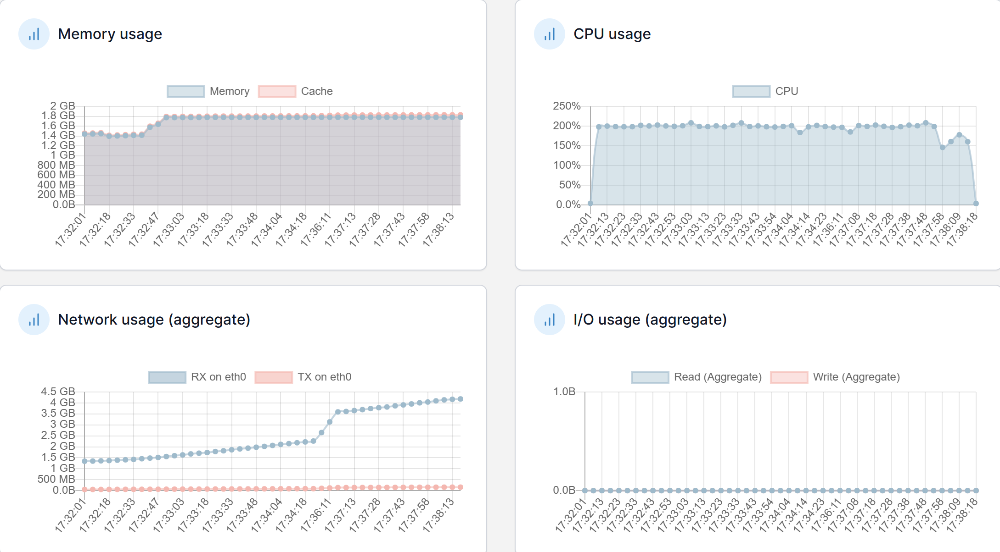
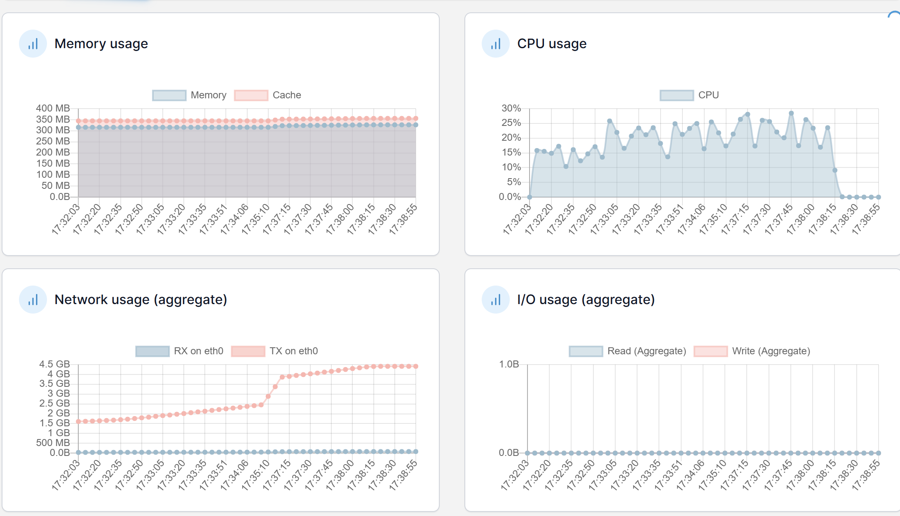
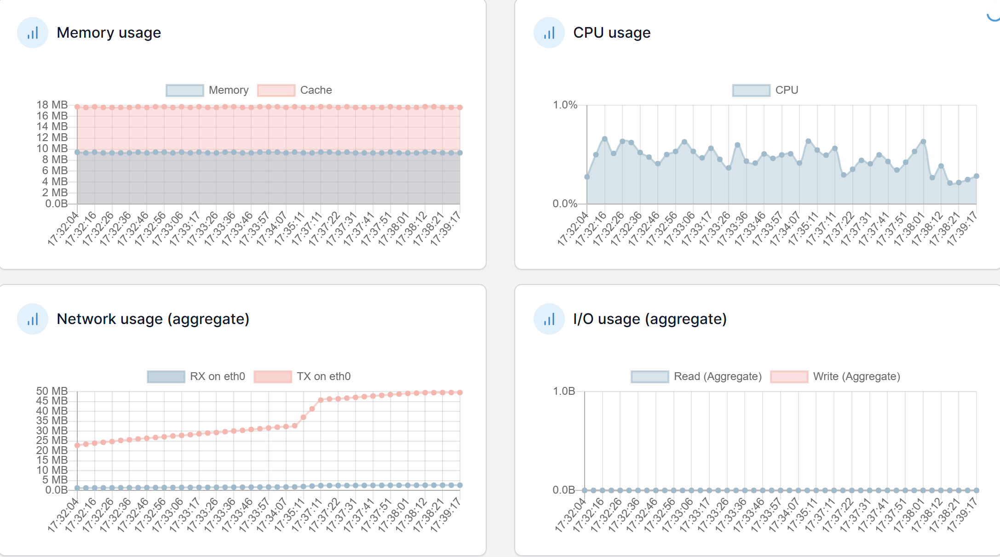

# 3차 성능 테스트 분석 보고서

## 3차 테스트 개선사항

1. Comment 조회 로직 최적화
    - N+1 쿼리 문제 해결
        - `@Query`를 사용한 fetch join 적용
        - batch size 설정 (100)으로 컬렉션 조회 최적화
    - 재귀적 쿼리 최적화
        - CTE(Common Table Expression)를 활용한 계층 쿼리 구현
        - 단일 쿼리로 전체 계층 구조 조회
    - 메모리 최적화
        - 페이징 처리 적용
        - 불필요한 컬렉션 로딩 제거

## 2️⃣ 성능 비교 분석

## 📊 API 응답 시간 및 성능 비교

| API | 2차 테스트 |  | 3차 테스트 |  | 개선율 |  |
| --- | --- | --- | --- | --- | --- | --- |
|  | Avg(ms) | TPS | Avg(ms) | TPS | Avg | TPS |
| 로그인 | 5,908 | 7.53 | 4,161 | 10.75 | 29.6% ⬇️ | 42.8% ⬆️ |
| 인기 게시글 목록 조회 | 4,988 | 7.53 | 3,169 | 10.75 | 36.5% ⬇️ | 42.8% ⬆️ |
| 인기 게시글 조회 | 5,691 | 7.53 | 3,663 | 10.75 | 35.6% ⬇️ | 42.8% ⬆️ |
| 인기 게시글 댓글 페이징 조회 | 6,507 | 7.53 | 3,463 | 10.75 | 46.8% ⬇️ | 42.8% ⬆️ |
| 포스트 좋아요 | 4,461 | 3.76 | 2,901 | 5.35 | 35.0% ⬇️ | 42.4% ⬆️ |
| 포스트 좋아요 취소 | 6,895 | 1.88 | 6,237 | 2.67 | 9.5% ⬇️ | 42.3% ⬆️ |
| 루트 댓글 작성 | 3,655 | 1.13 | 2,388 | 1.61 | 34.7% ⬇️ | 42.3% ⬆️ |
| 대댓글 | 7,349 | 0.68 | 4,952 | 0.97 | 32.6% ⬇️ | 41.8% ⬆️ |

## 3️⃣ 시스템 리소스 현황 비교

### Application Server

| 지표 | 2차 테스트 | 3차 테스트 | 상태 |
| --- | --- | --- | --- |
| CPU | 200% | 200% | ✅ 유지 |
| Memory | 2.5GB | 1.8GB | ✅ 감소 |
| Network | 안정적 | 더욱 안정적 | ✅ 개선 |

### Database Server

| 지표 | 2차 테스트 | 3차 테스트 | 상태 |
| --- | --- | --- | --- |
| CPU | 90~140% | 15~25% | ✅ 대폭 개선 |
| Memory | 300MB | 300MB | ✅ 유지 |
| Network | 안정적 | 더욱 안정적 | ✅ 개선 |

### Redis Server

| 지표 | 2차 테스트 | 3차 테스트 | 상태 |
| --- | --- | --- | --- |
| CPU | ~1% | ~1% | ✅ 유지 |
| Memory | ~10MB | ~10MB | ✅ 유지 |
| Network | 안정적 | 안정적 | ✅ 유지 |

## 4️⃣ 개선 효과 분석

### 🎯 주요 성과

1. **처리량(TPS)**
    - 전체 API 평균 42% TPS 증가
    - 모든 API에서 40% 이상의 처리량 개선
    - 특히 주요 조회 API들이 7.5 TPS → 10.7 TPS로 크게 개선
2. **시스템 안정성**
    - 에러율 유지/감소 (대부분 0.08%로 개선)
    - 응답시간 표준편차 감소로 예측 가능성 향상

---

| Label | # Samples | Average | Min | Max | Std. Dev. | Error % | Throughput | Received KB/sec | Sent KB/sec | Avg. Bytes |
| --- | --- | --- | --- | --- | --- | --- | --- | --- | --- | --- |
| 로그인 | 4000 | 4161 | 72 | 9790 | 1014.83 | 0.08% | 10.75136 | 5.49 | 4.04 | 522.6 |
| 인기 게시글 목록 조회 | 4000 | 3169 | 3 | 8504 | 1009.99 | 0.08% | 10.75347 | 61.48 | 3.28 | 5854.9 |
| 인기 게시글 조회 | 4000 | 3663 | 3 | 7681 | 1024.96 | 0.08% | 10.75283 | 21.88 | 3.25 | 2084 |
| 인기게시글 댓글 페이징 조회 | 4000 | 3463 | 3 | 7672 | 988.65 | 0.08% | 10.75266 | 27.22 | 3.34 | 2592.4 |
| 인기게시글 대댓글 전부 조회 | 4000 | 7066 | 3 | 8475 | 1031.91 | 0.08% | 10.75156 | 4.07 | 3.39 | 387.4 |
| 포스트 좋아요 | 2000 | 2901 | 3 | 8790 | 1032.81 | 0.15% | 5.34748 | 22.56 | 1.75 | 4319.8 |
| 포스트 좋아요 취소 | 1000 | 6237 | 3 | 7439 | 1037.79 | 0.30% | 2.67331 | 0.86 | 0.88 | 331.1 |
| 루트 댓글 작성 | 600 | 2388 | 6 | 6365 | 1018.19 | 0.00% | 1.61401 | 0.69 | 0.65 | 437.7 |
| 대댓글 | 360 | 4952 | 7 | 6559 | 1058.52 | 0.00% | 0.96919 | 0.41 | 0.4 | 433.6 |