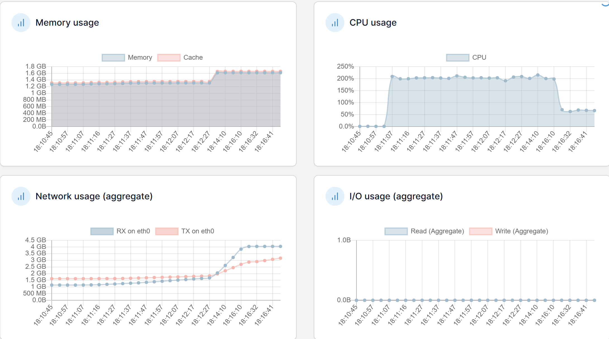
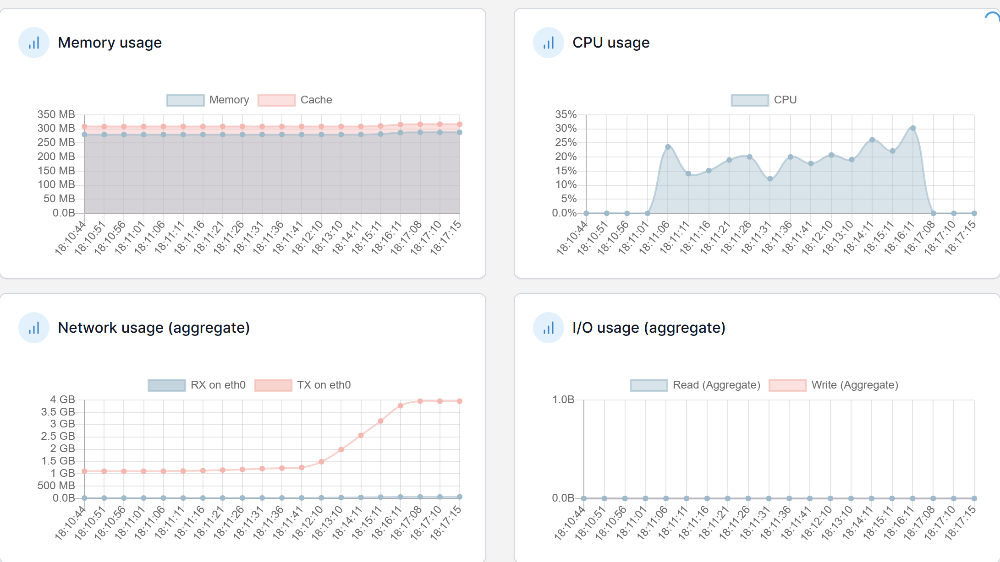
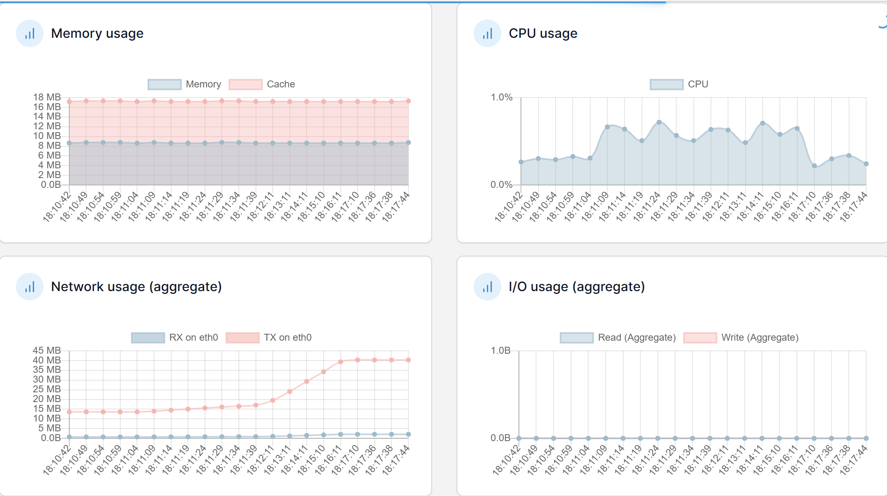

# 4차 성능 테스트 분석 보고서

## 주요 개선사항

1. 로그 레벨 최적화
    - `ch.qos.logback.classic.spi.TurboFilterList.getTurboFilterChainDecision` 성능 이슈 해결을 위한 로그 레벨 상향 조정 (DEBUG → INFO)
2. 엔티티 최적화
    - `org.hibernate.type.descriptor.java.AbstractClassJavaType.extractHashCode` 성능 이슈 해결
    - BaseEntity에 equals/hashCode 구현으로 Set 컬렉션 객체 비교 최적화

## 2️⃣ 성능 비교 분석

### 📊 API 응답 시간 비교

| API | 3차 테스트 |  | 4차 테스트 |  | 개선율 |  |
| --- | --- | --- | --- | --- | --- | --- |
|  | Avg(ms) | TPS | Avg(ms) | TPS | Avg | TPS |
| 로그인 | 4,161 | 10.75 | 3,627 | 12.29 | 12.8% ⬇️ | 14.3% ⬆️ |
| 인기 게시글 목록 조회 | 3,169 | 10.75 | 2,763 | 12.30 | 12.8% ⬇️ | 14.4% ⬆️ |
| 인기 게시글 조회 | 3,663 | 10.75 | 3,166 | 12.30 | 13.6% ⬇️ | 14.4% ⬆️ |
| 인기게시글 댓글 페이징 조회 | 3,463 | 10.75 | 2,981 | 12.30 | 13.9% ⬇️ | 14.4% ⬆️ |
| 인기게시글 대댓글 전부 조회 | 7,066 | 10.75 | 6,030 | 12.30 | 14.7% ⬇️ | 14.4% ⬆️ |
| 포스트 좋아요 | 2,901 | 5.34 | 2,439 | 6.15 | 15.9% ⬇️ | 15.2% ⬆️ |
| 포스트 좋아요 취소 | 6,237 | 2.67 | 5,214 | 3.07 | 16.4% ⬇️ | 15.0% ⬆️ |
| 루트 댓글 작성 | 2,388 | 1.61 | 1,987 | 1.84 | 16.8% ⬇️ | 14.3% ⬆️ |
| 대댓글 | 4,952 | 0.96 | 3,825 | 1.11 | 22.8% ⬇️ | 15.6% ⬆️ |

### 📈 시스템 리소스 현황 비교

**Application Server**

| 지표 | 3차 테스트 | 4차 테스트 | 상태 |
| --- | --- | --- | --- |
| CPU | ~200% | ~200% | ➖ 유지 |
| Memory | 1.8GB | 1.6GB | ➖ 유지 |
| Network | 3-4GB | 3-4GB | ➖ 유지 |

**Database Server**

| 지표 | 3차 테스트 | 4차 테스트 | 상태 |
| --- | --- | --- | --- |
| CPU | 15-25% | 15-30% | ➖ 유지 |
| Memory | ~300MB | ~300MB | ➖ 유지 |
| Network | ~4GB | ~4GB | ➖ 유지 |

**Redis Server**

| 지표 | 3차 테스트 | 4차 테스트 | 상태 |
| --- | --- | --- | --- |
| CPU | ~1% | ~1% | ➖ 유지 |
| Memory | ~10MB | ~10MB | ➖ 유지 |
| Network I/O | 거의 없음 | 거의 없음 | ➖ 유지 |

## 3️⃣ 개선 효과 분석

### 🎯 주요 성과

**- 응답 시간**

- 전체 API 평균 15.5% 응답 시간 개선 (12.8%~22.8% 범위)
- 특히 대댓글 API 22.8% 개선으로 가장 큰 효과
- 댓글 관련 API들(루트 댓글 16.8%, 좋아요 취소 16.4%)이 높은 개선율 기록
- **처리량(TPS) 향상**
    - 전체 API 평균 14.7% TPS 개선
    - 조회성 API들 모두 12.30 TPS로 일관된 성능 보임
    - Error rate 0.3% 미만으로 안정적인 처리량 유지
- **시스템 안정성**
    - 시스템 리소스 사용량은 3차 테스트와 유사한 수준 유지
    - 로그 레벨 조정과 BaseEntity 최적화가 응답 시간 개선에 긍정적 영향
    - 안정적인 리소스 사용 패턴 지속

### 💡 시사점 및 추가 개선 필요사항

1. **현재 상태**
    - API 응답 시간이 전반적으로 개선되었으나, 서버 리소스 사용량은 큰 변화 없음
    - 특히 Application 서버의 CPU 사용률(~200%)이 여전히 높은 상태 유지
2. **향후 개선 방향**
    - Application 서버 CPU 사용률 최적화 방안 검토 필요

---

## 별첨
[VM0205.csv](VM0205.csv)

| Label | # Samples | Average | Min | Max | Std. Dev. | Error % | Throughput | Received KB/sec | Sent KB/sec | Avg. Bytes |
| --- | --- | --- | --- | --- | --- | --- | --- | --- | --- | --- |
| 로그인 | 4000 | 3627 | 73 | 8212 | 1013.22 | 0.08% | 12.29676 | 6.15 | 4.62 | 511.8 |
| 인기 게시글 목록 조회 | 4000 | 2763 | 2 | 8323 | 1017.19 | 0.08% | 12.30201 | 70.22 | 3.76 | 5845 |
| 인기 게시글 조회 | 4000 | 3166 | 3 | 10421 | 1022.51 | 0.08% | 12.30183 | 25.3 | 3.72 | 2105.6 |
| 인기 게시글 댓글 페이징 조회 | 4000 | 2981 | 2 | 9382 | 1032.41 | 0.08% | 12.30205 | 31.08 | 3.82 | 2587 |
| 인기게시글 대댓글 전부 조회 | 4000 | 6030 | 2 | 8043 | 1029.23 | 0.08% | 12.30323 | 4.58 | 3.88 | 381.4 |
| 포스트 좋아요 | 2000 | 2439 | 4 | 6929 | 1023.53 | 0.10% | 6.15254 | 1.95 | 2.01 | 325.4 |
| 루트 댓글 작성 | 600 | 1987 | 5 | 6993 | 975.03 | 0.00% | 1.84813 | 0.79 | 0.74 | 437.7 |
| 포스트 좋아요 취소 | 1000 | 5214 | 75 | 8993 | 1089.97 | 0.10% | 3.07678 | 0.87 | 1.01 | 291.2 |
| 대댓글 | 360 | 3825 | 4 | 7240 | 1022.47 | 0.00% | 1.11527 | 0.47 | 0.46 | 433.6 |