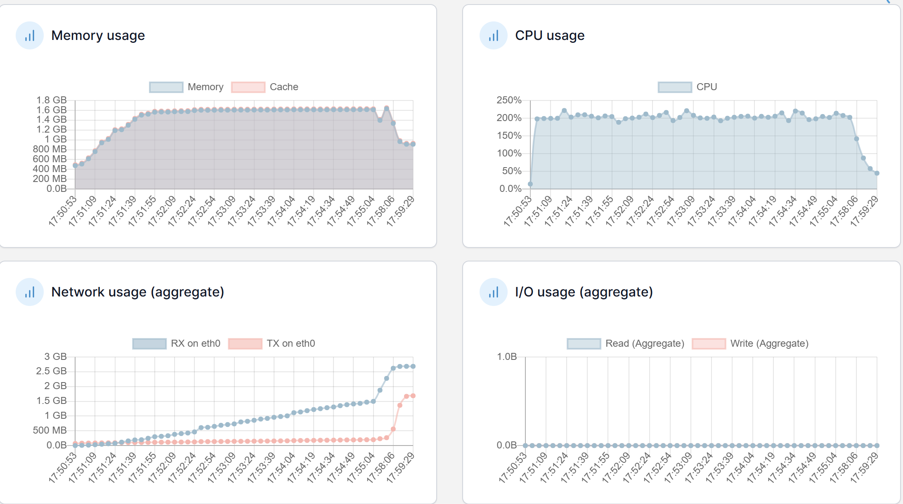
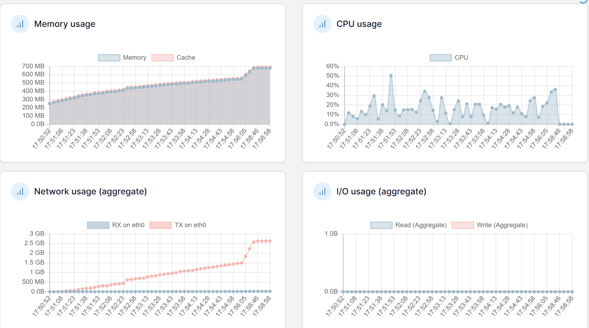
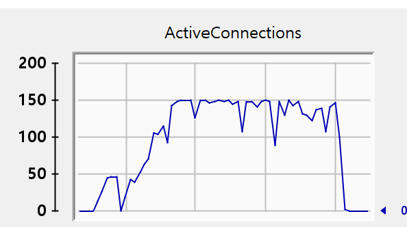
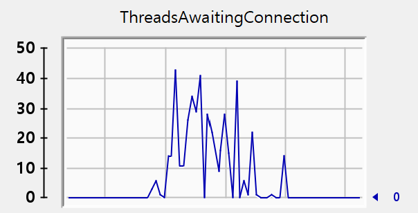

# 5차 성능 테스트 분석

주요 개선사항

1. 커넥션 풀 최적화
    - HikariCP maximum-pool-size 150으로 증가 (기존 50개)
    - minimum-idle: 20, connection-timeout: 20초 등 타임아웃 설정 최적화
2. 엔티티 관계 최적화
    - User-Role 관계를 EAGER에서 LAZY로 변경
    - username 필드에 인덱스 추가 (@Index 적용)
3. pre-partial-flush 최적화
    - 댓글 조회 시 Projection 적용으로 영속성 컨텍스트 부하 감소

2️⃣ 성능 비교 분석

## 📊 API 응답 시간 비교

| API | 4차 테스트 |  | 5차 테스트 |  | 개선율 |  |
| --- | --- | --- | --- | --- | --- | --- |
|  | Avg(ms) | TPS | Avg(ms) | TPS | Avg | TPS |
| 로그인 | 3,627 | 12.29 | 5,451 | 8.79 | 50.3% ⬆️ | 28.5% ⬇️ |
| 인기 게시글 목록 조회 | 2,763 | 12.30 | 1,567 | 8.80 | 43.3% ⬇️ | 28.5% ⬇️ |
| 인기 게시글 조회 | 3,166 | 12.30 | 2,204 | 8.81 | 30.4% ⬇️ | 28.4% ⬇️ |
| 인기게시글 댓글 페이징 조회 | 2,981 | 12.30 | 1,315 | 8.75 | 55.9% ⬇️ | 28.9% ⬇️ |
| 인기게시글 대댓글 전부 조회 | 6,030 | 12.30 | 10,175 | 8.75 | 68.7% ⬆️ | 28.9% ⬇️ |
| 포스트 좋아요 | 2,439 | 6.15 | 1,357 | 4.38 | 44.4% ⬇️ | 28.8% ⬇️ |
| 루트 댓글 작성 | 1,987 | 1.84 | 1,262 | 1.31 | 36.5% ⬇️ | 28.8% ⬇️ |
| 대댓글 | 3,825 | 1.11 | 1,437 | 0.79 | 62.4% ⬇️ | 28.8% ⬇️ |
| 포스트 좋아요 취소 | 5,214 | 3.07 | 13,201 | 2.19 | 153.2% ⬆️ | 28.7% ⬇️ |

📈 시스템 리소스 현황 비교
**Application Server**

| 지표 | 4차 테스트 | 5차 테스트 | 상태 |
| --- | --- | --- | --- |
| CPU | ~200% | ~200% | ➖ 유지 |
| Memory | 1.6GB | 1.6GB | ➖ 유지 |
| Network | 3-4GB | 3-4GB | ➖ 유지 |

**Database Server**

| 지표 | 4차 테스트 | 5차 테스트 | 상태 |
| --- | --- | --- | --- |
| CPU | 15-30% | 30-40% | ⬆️ 증가 |
| Memory | ~300MB | ~700MB | ⬆️ 증가 |
| Network | ~4GB | ~2.5GB | ⬇️ 감소 |

**Redis Server**

| 지표 | 4차 테스트 | 5차 테스트 | 상태 |
| --- | --- | --- | --- |
| CPU | ~1% | ~1% | ➖ 유지 |
| Memory | ~10MB | ~10MB | ➖ 유지 |
| Network | 거의 없음 | 거의 없음 | ➖ 유지 |

**TheadPool**

3️⃣ 개선 효과 분석

## 주요 분석 결과

1. **응답 시간**
    - 6개 API에서 30~62% 응답 시간 개선
    - 3개 API에서 응답 시간 증가
        - 포스트 좋아요 취소(153.2%⬆️) - 가장 큰 폭 증가
        - 로그인(50.3%⬆️)
        - 대댓글 전체 조회(68.7%⬆️)
2. **처리량(TPS)**
    - 모든 API에서 약 28~29% TPS 감소
    - 조회성 API들 8.7~8.8 TPS로 수렴
    - 쓰기 작업은 상대적으로 낮은 TPS (0.79~4.38)
3. **성능 개선점**
    - 커넥션 풀 확장(50→150)으로 동시처리 능력 향상
    - User-Role Lazy 로딩 전환으로 불필요한 조인 감소
    - Projection 도입으로 영속성 컨텍스트 부하 감소
    - DB 서버의 적극적 리소스 활용으로 쿼리 처리 속도 개선

## 해결 필요 사항

1. **성능 저하 원인 분석**
    - Error rate 소폭 상승 (0.1~0.6%)
    - 포스트 좋아요 취소 API의 급격한 성능 저하(153.2%) 원인 파악
    - 로그인 API 성능 저하(50.3%) - username 인덱스 추가에도 불구하고 발생
2. **시스템 최적화 필요**
    - Application 서버 CPU 사용률(200%) 최적화
        - 스레드 풀 설정 검토
        - 비동기 처리 가능 부분 식별
    - DB 서버 리소스 효율화
        - 증가한 CPU/Memory 사용량 모니터링
        - 인덱스 사용 패턴 분석

## 향후 개선 방향

1. **캐시 전략 재검토**
    - Redis 활용도 증대 방안 검토
    - 캐시 적중률 향상 방안 모색
2. **전반적 성능 안정화**
    - TPS 감소 원인 분석 및 개선
    - 응답시간이 증가한 API들의 병목 구간 식별
    - 전체적인 시스템 안정성 향상을 위한 아키텍처 검토

이번 테스트에서는 일부 API의 응답 시간이 개선되었으나, 전체적인 처리량(TPS)이 28~29% 감소했습니다. 특히 포스트 좋아요 취소(153.2%↑), 로그인(50.3%↑), 대댓글 전체 조회(68.7%↑) API의 성능 저하가 심각하여 원인 분석과 개선이 시급합니다. Application 서버의 CPU 사용률(200%)과 함께 전반적인 시스템 최적화가 필요한 상황입니다.

--
## 별첨
[API 응답 수치.csv](summary0206.csv)

[visualVM 핫스팟_1.csv](VM0206_1.csv)

[visualVM 핫스팟_2.csv](VM0206_2.csv)

[visualVM 핫스팟_3.csv](VM0206_3.csv)