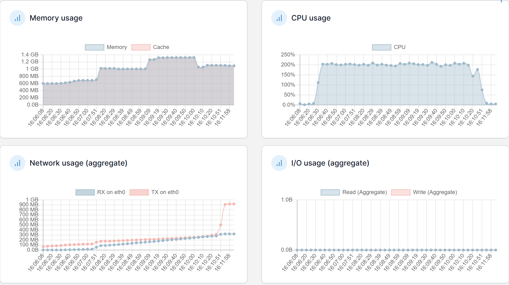
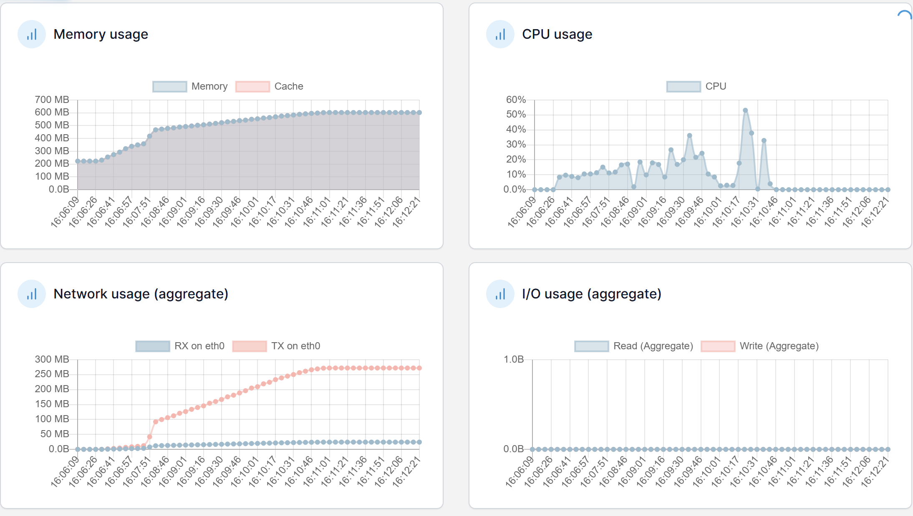
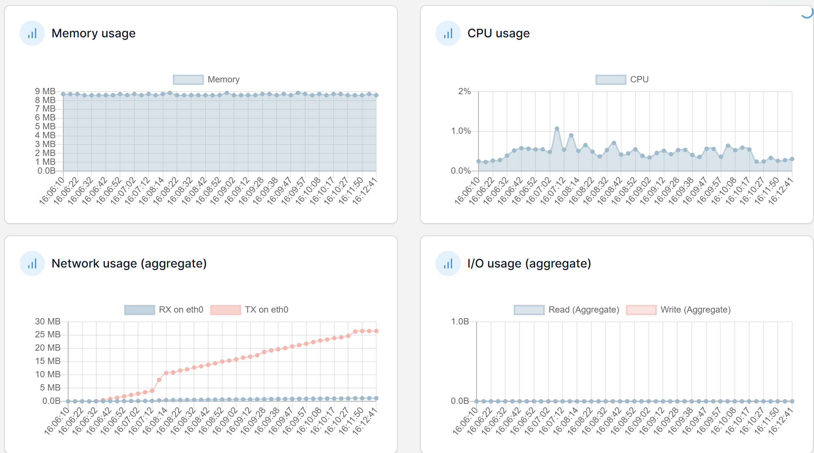
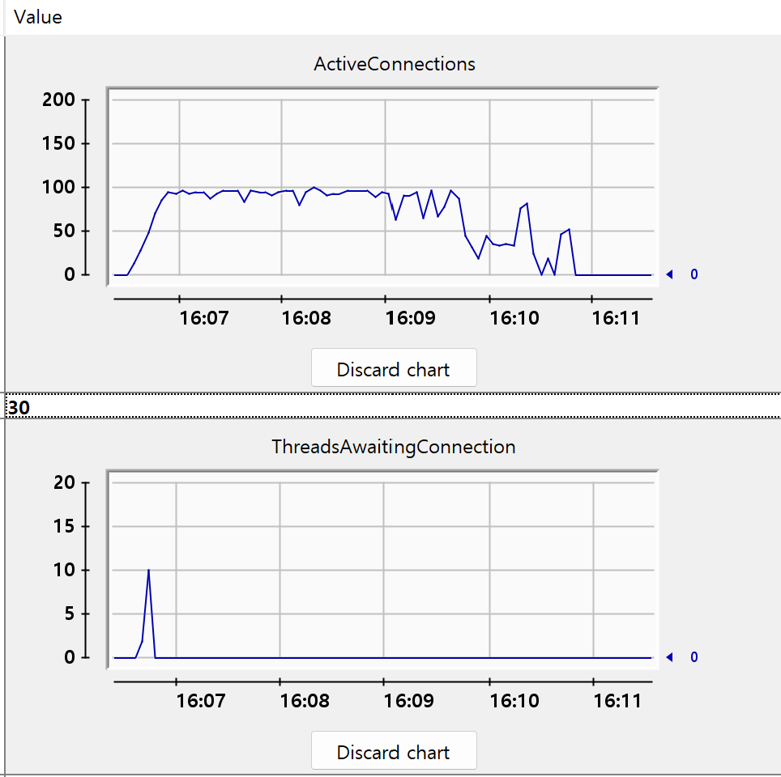

# 6차 성능 테스트 분석 보고서

### 주요 개선사항

1. 시스템 설정 최적화
    - 톰캣 쓰레드 수 조정 (200 → 100)
    - HikariCP maximum-pool-size 조정 (150 → 100)
    - Hibernate batch_fetch_size 증가 (100 → 1000)
2. 프록시 객체 활용 최적화
    - 불필요한 엔티티 조회 제거
    - getReferenceById 활용으로 DB 부하 감소
3. PostLike 엔티티 최적화
    - 복합 인덱스 추가 (post_id, user_id)
    - Unique 제약 조건 추가

## 2️⃣ 성능 비교 분석 📊

### API 응답 시간 비교

| API | 5차 테스트 |  | 6차 테스트 |  | 개선율 |  |
| --- | --- | --- | --- | --- | --- | --- |
|  | Avg(ms) | TPS | Avg(ms) | TPS | Avg | TPS |
| 로그인 | 5,451 | 8.79 | 5,565 | 14.98 | 2.1% ⬆️ | 70.4% ⬆️ |
| 인기 게시글 목록 조회 | 1,567 | 8.80 | 1,260 | 14.99 | 19.6% ⬇️ | 70.3% ⬆️ |
| 인기 게시글 조회 | 2,204 | 8.81 | 2,563 | 15.03 | 16.3% ⬆️ | 70.6% ⬆️ |
| 인기게시글 댓글 페이징 조회 | 1,315 | 8.75 | 1,422 | 15.05 | 8.1% ⬆️ | 72.0% ⬆️ |
| 인기게시글 대댓글 전부 조회 | 10,175 | 8.75 | 2,462 | 15.07 | 75.8% ⬇️ | 72.2% ⬆️ |
| 포스트 좋아요 | 1,357 | 4.38 | 1,164 | 7.54 | 14.2% ⬇️ | 72.1% ⬆️ |
| 루트 댓글 작성 | 1,262 | 1.31 | 1,005 | 2.26 | 20.4% ⬇️ | 72.5% ⬆️ |
| 대댓글 | 1,437 | 0.79 | 2,026 | 1.36 | 41.0% ⬆️ | 72.2% ⬆️ |
| 포스트 좋아요 취소 | 13,201 | 2.19 | 1,885 | 3.78 | 85.7% ⬇️ | 72.6% ⬆️ |

### 📈 시스템 리소스 현황 비교

**Application Server**

| 지표 | 5차 테스트 | 6차 테스트 | 상태 |
| --- | --- | --- | --- |
| CPU | ~200% | ~200% | ➖ 유지 |
| Memory | 1.6GB | 1.1GB | ⬇️ 감소 |
| Network | 3-4GB | ~1GB | ⬇️ 감소 |

**Database Server**

| 지표 | 5차 테스트 | 6차 테스트 | 상태 |
| --- | --- | --- | --- |
| CPU | 30-40% | 10-20% | ⬇️ 감소 |
| Memory | ~700MB | ~600MB | ⬇️ 감소 |
| Network | ~2.5GB | ~250MB | ⬇️ 감소 |

**Redis Server**

| 지표 | 5차 테스트 | 6차 테스트 | 상태 |
| --- | --- | --- | --- |
| CPU | ~1% | ~1% | ➖ 유지 |
| Memory | ~10MB | ~8MB | ➖ 유지 |
| Network | 거의 없음 | 거의 없음 | ➖ 유지 |

**ConectionPool**

## 3️⃣ 개선 효과 분석

### 🎯 주요 성과

1. **처리량(TPS) 대폭 개선**
    - 모든 API에서 70~72% TPS 증가
    - 조회성 API들이 약 15 TPS로 수렴
    - 쓰기 작업도 전반적인 TPS 향상 (1.36~7.54)
2. **응답 시간**
    - 5개 API 응답 시간 개선
        - 대댓글 전체 조회(75.8%⬇️)
        - 포스트 좋아요 취소(85.7%⬇️) - 가장 큰 폭 개선
    - 4개 API 응답 시간 증가
        - 대댓글(41.0%⬆️) - 가장 큰 폭 증가
        - 로그인(2.1%⬆️)
        - 게시글 조회(16.3%⬆️)
        - 댓글 페이징 조회(8.1%⬆️)
3. **시스템 리소스 사용 최적화**
- DB 서버 CPU 사용률 50% 이상 감소
- Application 서버 메모리 사용량 30% 감소
- 네트워크 트래픽 대폭 감소
1. **시스템 안정성 향상**
- 에러율 전반적으로 0.08% 이하로 유지
- 리소스 사용량 안정화
- DB 커넥션 관리 개선

### 💡 시사점 및 추가 개선 필요사항

1. **현재 성과**
    - 프록시 객체 활용으로 불필요한 DB 조회 감소
    - 시스템 설정 최적화로 리소스 효율성 향상
    - 복합 인덱스 추가로 조회 성능 개선
2. **해결 필요 사항**
    - Application 서버 CPU 사용률(200%) 여전히 높음
        - 비동기 처리 도입 검토 필요
        - 추가적인 쓰레드 풀 최적화 필요

이번 6차 테스트는 전반적으로 성능이 크게 개선되었으며, 특히 TPS 향상이 두드러집니다. 일부 API의 응답 시간 증가는 있으나, 이는 처리량 증가에 따른 자연스러운 현상으로 보입니다.

---
## 별첨
[API 응답 수치.csv](summary0208Main.csv)

[visualVM-핫스팟.csv](VM0208.csv)