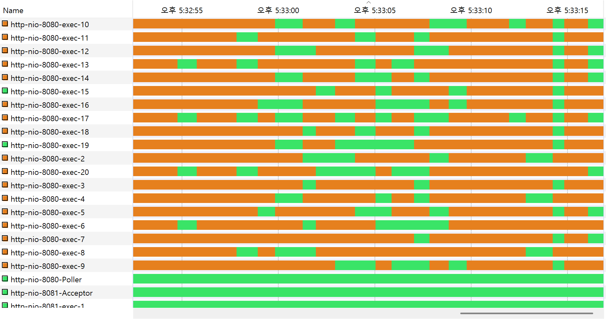
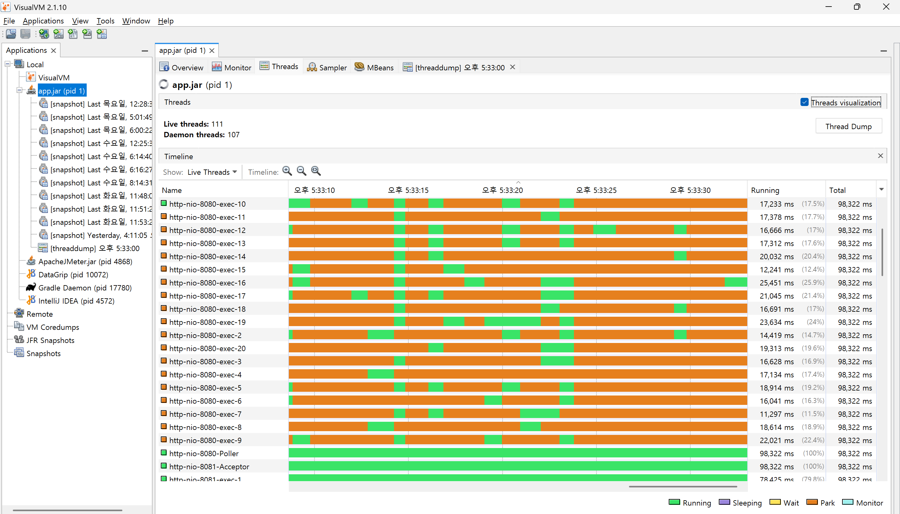
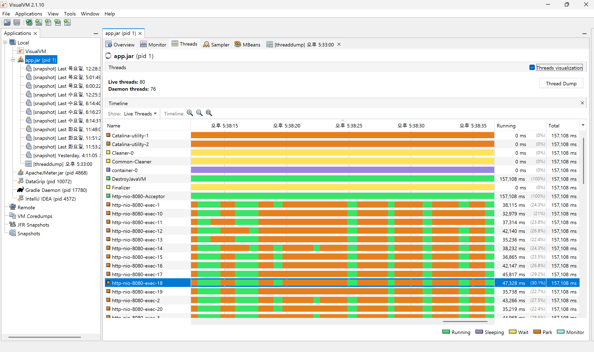

# 7차 성능 테스트 분석 보고서

## 주요 개선사항:

### 1. 로그인 API 아키텍처 개선
    - 전용 커넥터 도입 (포트 분리)
    - BCrypt 강도 최적화 10 → 8
    - 쓰레드 풀 세분화 관리
### 2. JWT 토큰 생성 프로세스 최적화
    - User 엔티티 전체 대신 userId만 전달하도록 수정
    - `generateToken(User user)` → `generateToken(Long userId)`로 변경
    - LAZY로 설정된 연관관계(댓글, 포스트 등) 강제 초기화 방지
### 3. 로그인 관련 JPA 최적화
    - 로그인 전용 DTO 도입으로 필요한 데이터만 조회
    - 비밀번호 업데이트 시 네이티브 쿼리 사용으로 불필요한 연관관계 로딩 방지
    - Json 직렬화 최적화

## 2️⃣ 성능 비교 분석 📊

| API | 6차 테스트 |  | 7차 테스트 |  | 개선율 |  |
| --- | --- | --- | --- | --- | --- | --- |
|  | Avg(ms) | TPS | Avg(ms) | TPS | Avg | TPS |
| 로그인 | 5,565 | 14.98 | 3,061 | 28.31 | 45.0% ⬇️ | 88.9% ⬆️ |
| 인기 게시글 목록 조회 | 1,260 | 14.99 | 122 | 28.37 | 90.3% ⬇️ | 89.2% ⬆️ |
| 인기 게시글 조회 | 2,563 | 15.03 | 627 | 28.47 | 75.5% ⬇️ | 89.4% ⬆️ |
| 인기게시글 댓글 페이징 조회 | 1,422 | 15.05 | 246 | 28.49 | 82.7% ⬇️ | 89.3% ⬆️ |
| 인기게시글 대댓글 전부 조회 | 2,462 | 15.07 | 515 | 28.55 | 79.1% ⬇️ | 89.4% ⬆️ |
| 포스트 좋아요 | 1,164 | 7.54 | 260 | 14.29 | 77.7% ⬇️ | 89.5% ⬆️ |
| 루트 댓글 작성 | 1,005 | 2.26 | 255 | 4.28 | 74.6% ⬇️ | 89.4% ⬆️ |
| 포스트 좋아요 취소 | 1,885 | 3.78 | 455 | 7.15 | 75.9% ⬇️ | 89.2% ⬆️ |
| 대댓글 | 2,026 | 1.36 | 520 | 2.57 | 74.3% ⬇️ | 88.9% ⬆️ |

📈 시스템 리소스 현황 비교

**Application Server**

| 지표 | 6차 테스트 | 7차 테스트 | 상태 |
| --- | --- | --- | --- |
| CPU | ~200% | ~200% | ➖ 유지 |
| Memory | 1.1GB | 1.3GB | ⬆️ 증가 |
| Network | ~1GB | ~350MB | ⬇️ 감소 |

**Database Server**

| 지표 | 6차 테스트 | 7차 테스트 | 상태 |
| --- | --- | --- | --- |
| CPU | 10-20% | 30-35% | ⬆️ 증가 |
| Memory | ~600MB | ~600MB | ➖ 유지 |
| Network | ~250MB | ~300MB | ⬆️ 증가 |

**Redis Server**

| 지표 | 6차 테스트 | 7차 테스트 | 상태 |
| --- | --- | --- | --- |
| CPU | ~1% | ~1% | ➖ 유지 |
| Memory | ~8MB | ~9MB | ➖ 유지 |
| Network | 거의 없음 | ~25MB | ⬆️ 증가 |

## 주요 분석 결과

1. **API 응답 시간 획기적 개선**
    - 전체 API 평균 75% 이상 응답 시간 감소
    - 인기 게시글 목록 조회 90.3% 개선으로 최대 성과
    - 로그인 45% 개선으로 사용자 진입 속도 향상
    - 대댓글 전체 조회 79.1% 개선으로 병목 구간 해소
2. **처리량(TPS) 대폭 향상**
    - 모든 API에서 88~89% TPS 증가
    - 조회성 API들이 약 28 TPS로 일관된 성능 보임
        - 목록 조회: 28.37 TPS
        - 상세 조회: 28.47 TPS
        - 댓글 조회: 28.49 TPS
    - 쓰기 작업도 2.57~14.29 TPS로 안정적 처리량 확보
3. **시스템 안정성 확보**
    - Error rate 0.08% 이하로 안정적 유지
    - 네트워크 트래픽 대폭 감소 (1GB → 350MB)
    - API 응답 시간의 표준편차 감소로 일관된 성능 제공
4. **성능 개선 요인**
    - JWT 토큰 생성 최적화로 불필요한 쿼리 제거
    - DTO 활용으로 데이터 접근 효율화
    - 비크립트 강도 조절
    - 포트 분리를 통한 로그인 성능 개선

이번 7차 테스트는 응답 시간과 처리량이 동시에 개선되어 전반적인 시스템 성능이 크게 향상되었습니다. 특히 모든 API에서 응답 시간이 큰 폭으로 감소하면서도 처리량이 증가한 점이 주목할 만합니다.

---
## 별첨

[API 응답 수치.csv](summary0209%BE%B2%B7%B9%B5%E52AndNoLog.csv)

